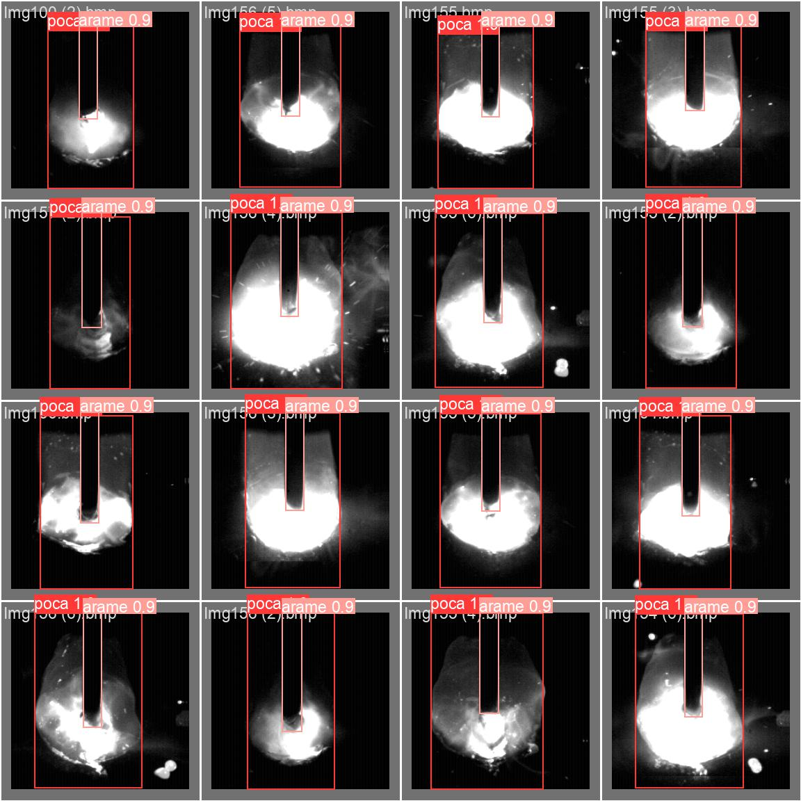
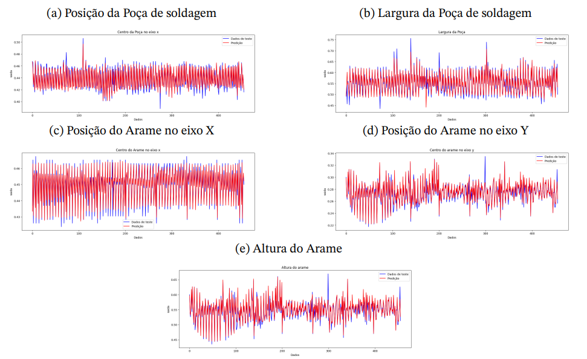
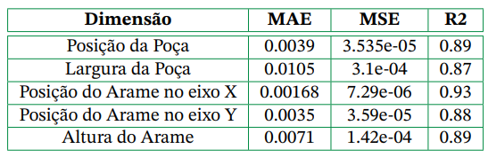

# Análise automática de imagens de soldagem GMAW utilizando técnicas de inteligência artificial
#### Lucas Henrique Alves Rosa - Projeto Final de Curso submetido como requisito parcial para obtenção do grau de Engenheiro de Controle e Automação

## Objetivo
O objetivo deste trabalho é desenvolver uma inteligência artificial capaz de identificar, a partir do processo de soldagem GMAW (\textit{Gas Metal Arc Welding}) convencional, a posição e largura da poça de soldagem, assim como a posição e altura do arame, com base em imagens do próprio processo. A soldagem GMAW é amplamente utilizada na indústria, e a capacidade de identificar parâmetros durante o processo pode auxiliar na otimização e controle da qualidade da solda.

Para alcançar esse objetivo, foram criadas redes neurais convolucionais que realizam a identificação de parâmetros relacionados ao momento da soldagem, poça de fusão e o arame, também conhecido como eletrodo. A arquitetura das redes neurais convolucionais foi baseada em modelos conhecidos, como LeNet, AlexNet e VGG, com ajustes em quase todos os parâmetros para melhorar o desempenho. Inicialmente, a rede não atingiu as expectativas para problemas de regressão, mas mostrou resultados promissores para problemas de classificação.

Como alternativa, adotou-se uma segunda abordagem utilizando a arquitetura YOLO (You Only Look Once), reconhecida por sua eficiência e precisão na detecção de objetos em imagens. A rede neural convolucional baseada na arquitetura YOLO foi treinada com um conjunto de dados adequado para o processo de soldagem GMAW convencional. Os resultados obtidos foram promissores, com a capacidade de identificar com precisão os parâmetros relacionados ao processo de soldagem a partir das imagens analisadas.

O projeto envolveu uma pesquisa abrangente sobre arquiteturas e técnicas usadas em redes neurais, além de experimentação e ajuste fino para obter os melhores resultados. As descobertas deste estudo contribuem para o campo da identificação automatizada de parâmetros em processos de soldagem, oferecendo potencial para maior eficiência, controle de qualidade e otimização em aplicações de soldagem industrial.

## Resultados YOLO

    
    
    
    

## Resultados CNN

